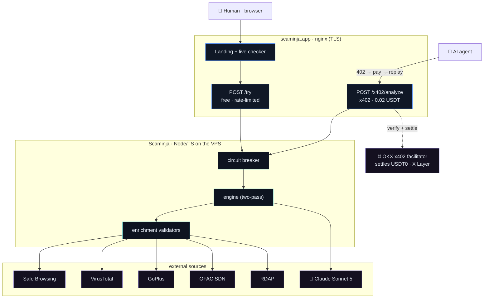
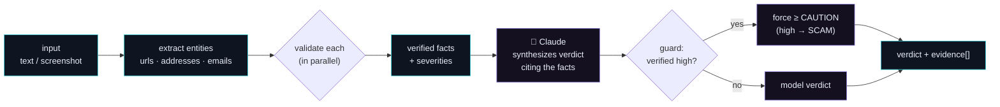
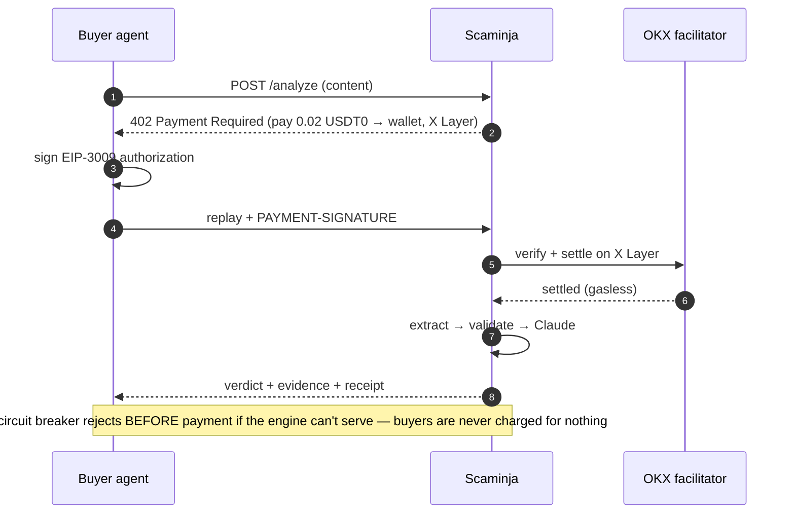

<div align="center">

# 🥷 Scaminja

**Is it legit? Know in seconds.**

Paste any message, link, email, or crypto wallet address → get an instant **Safe / Caution / Scam** verdict, backed by evidence from real security databases.

[](https://www.okx.ai)
[](https://web3.okx.com/xlayer)
[](https://github.com/okx/payments)
[](https://www.anthropic.com)

</div>

---

Scaminja is an **Agentic Service Provider on OKX.AI**. It turns "is this a scam?" into a fast, callable, evidence-backed service: extract every URL, address, and email from whatever you paste, verify each against authoritative databases (Google Safe Browsing, VirusTotal, GoPlus on-chain security, OFAC sanctions, domain records), and let Claude synthesize a verdict that **cites the proof** — tagging each finding `verified fact` vs `AI assessment`. Humans use it free on the web; AI agents pay per call over **x402** (0.02 USDT on **X Layer**).

## The problem

Everyone has an "is this legit?" moment — a parcel-fee text, a too-good job offer, a "connect your wallet to claim" link. The usual answers are a gut guess or asking a chatbot, which just gives an *opinion*. And in the agent economy, another AI agent handling your emails or trades has nowhere to *call* for a trustworthy, structured scam check.

Scaminja is that check. It doesn't guess — it verifies the concrete entities against sources that are authoritative (a Safe Browsing hit, a honeypot contract, an OFAC sanction are *facts*), and it never reports "safe" when a verified red flag exists. Because it's a standard A2MCP endpoint, any agent can rent it on demand and get JSON back.

## What it checks

| Entity | Sources (ground truth) |
|---|---|
| **URLs / links** | Google Safe Browsing · VirusTotal (70+ vendors) · domain age (RDAP) · shortener/redirect expansion · structure heuristics |
| **Brands** | typosquat + impersonation detection (`paypa1-secure` → PayPal) |
| **Crypto tokens** | GoPlus honeypot / can't-sell / hidden-owner / high-tax / unverified (ETH · BSC · X Layer) |
| **Crypto addresses** | GoPlus malicious-address · OFAC sanctions · drainer-site check |
| **Emails** | SPF / DKIM / DMARC authentication (spoofing proof), sender-domain age |

Every finding carries a `source` and a `kind` (`verified` \| `assessment`). SAFE stays cautious — absence of a flag is never treated as proof of safety.

## System architecture



## How a verdict is built

Two passes: validate the facts first, then reason over them.



## Paying agent flow (A2MCP)



## Verdict shape

```jsonc
{
  "verdict": "safe" | "caution" | "scam",
  "risk_score": 0-100, "confidence": 0-100,
  "title": "…", "summary": "…",
  "evidence": [{ "claim": "…", "source": "Google Safe Browsing", "kind": "verified", "severity": "high" }],
  "red_flags": [{ "label": "…", "detail": "…", "severity": "high" }],
  "recommended_actions": ["…"],
  "disclaimer": "Risk guidance, not a guarantee. Verify independently."
}
```

## Tech stack

| Layer | What |
|---|---|
| **Engine** | Claude Sonnet 5 (vision), structured outputs |
| **Enrichment** | Google Safe Browsing · VirusTotal · GoPlus · OFAC SDN · RDAP · deterministic brand/URL/email checks |
| **Payments** | OKX Payment SDK (`@okxweb3/x402-*`), x402 `exact` scheme, USDT0 on X Layer |
| **Server** | Node 20 + Express (TypeScript), pm2 behind nginx on a VPS |
| **Hardening** | per-IP + global rate limits, input caps, sanitized errors, HSTS, low-credit circuit breaker |

## Getting started

**Prerequisites:** Node 20+, an Anthropic API key. (Payments/enrichment keys optional for local dev.)

```bash
npm install
cp .env.example .env      # set ANTHROPIC_API_KEY
npm run smoke             # run the engine over sample scams
npm run dev               # server on :8080 (payments off)
```

Open `http://localhost:8080/` for the site, or:

```bash
curl -s localhost:8080/try -H "content-type: application/json" \
  -d '{"text":"ROYAL MAIL: unpaid £1.99 fee, pay: https://royalmail-redelivery.info/pay"}' | jq
```

Deploy notes: [`DEPLOY.md`](./DEPLOY.md) · Enrichment design: [`ENRICHMENT-PLAN.md`](./ENRICHMENT-PLAN.md)

---

<div align="center">
<sub>Scaminja · evidence, not opinion. An Agentic Service Provider on OKX.AI.</sub>
</div>
